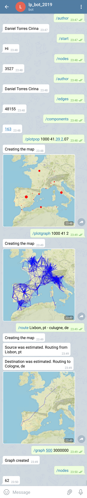

Daniel Torres

The course gave an overview of programming languages (Haskell, Python 3, Tcl, Ruby, ...), as well as a brief introduction to compilers. It also presented in more detail functional languages and its use to introduce new elements of programming languages, such as type systems or higher-order programming. It showed how these languages can be used to specify and model hardware and software or, for instance, in financial applications. Finally, scripting languages were considered for its increasingly use in both the prototyping and the development of applications. As a general aim, the course worked the ability to learn new languages.

$ python3 telegram_bot.py
Executes the bot and allows it to communicate trough Telegram.

bot address: t.me/MapsLP2019Bot

In case Telegram isn't available to test there is commands.py with everything 
necessary to execute each functionality.

Here are all the commands that you can execute:

* /start
  Initializes the bot

* /author
To know my creator.
* /graph ⟨distance⟩ ⟨population⟩
  To create a new graph with a maximum distance=⟨distance⟩ between
  each pair of connected cities and a minimum of population=⟨population⟩
  Example:

  ​	/graph 300 100000

* /nodes
  To know the number of cities in the graph

* /edges
  To know the number of edges connecting the graph

* /components
  To know the number of connected components in the graph

* /plotpop ⟨dist⟩ [⟨lat⟩ ⟨lon⟩]
  Shows a map with all the cities in the graphs at distance<=dist from ⟨lat⟩ ⟨lon⟩.
  Example:
    /plotpop 1000 41.39 2.07

* /plotgraph ⟨dist⟩ [⟨lat⟩ ⟨lon⟩]
  Shows a map with all the cities in the graphs at distance<=dist from ⟨lat⟩ ⟨lon⟩ and all the edges connecting the cities.
  Example:
    /plotgraph 1000 41.39 2.07

* /route ⟨src⟩ ⟨dst⟩
  Shows a map with all the edges that make the shortest past between the two cities.
  Example:
    /route Lixbun, pt - culugne, de
    Where Lixbun is Lisbon, Portugal and culugne is Cologne, Deutschland
    That's right, I can sense which city you meant. But... only if you put the country code correctly

